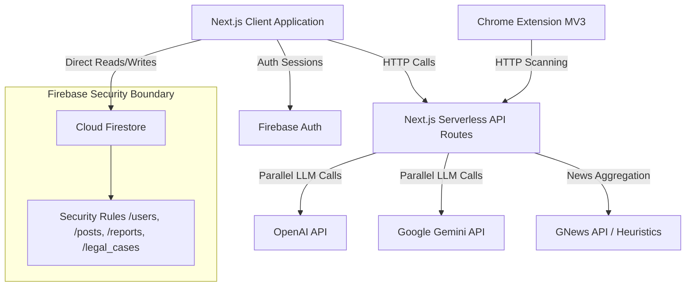

# CyberSaathi - Indian Cyber Safety Platform

CyberSaathi is a comprehensive, production-ready full-stack cyber safety platform designed to educate, assist, and protect Indian users. It combines state-of-the-art AI assistance, dual-model scam detection (GPT + Gemini), secure direct-to-Firestore data storage with strict role-based rules, community support boards, ed-tech learning pathways, and a security-focused Chrome Extension.

---

## 1. System Architecture

CyberSaathi is built using a hybrid client-server architecture designed for maximum performance, security, and real-time response:



- **Direct Client-to-Firestore Data Stream**: For high-trust, responsive updates (like community Q&As, blogs, reports, and legal case drafts), the client React app interacts directly with Cloud Firestore. All operations are checked at the database boundary by role-aware [Security Rules](file:///Users/sanjeevchaurasia/My%20Projects/CyberSaathi/firestore.rules).
- **Serverless API Routes**: Operations requiring private credentials or heavyweight processing (e.g., dual-AI assessments, chat memory construction, external news API fetch) run via Next.js serverless route handlers.
- **Chrome Extension integration**: Installs directly in the user's browser, intercepting web navigation and checking URLs against the serverless scam analyzer API in the background.

---

## 2. Dependencies

The application relies on a modern, type-safe stack:

### Core Frameworks & Styling
- **Next.js 16** (App Router): Provides serverless route handlers, static page rendering, and route optimization.
- **React 19 & React DOM 19**: Underlying runtime rendering engines.
- **Tailwind CSS 4**: Next-gen CSS compiler for styling.
- **Lucide React**: Premium icon pack for dashboard widgets.

### Database & Authentication
- **Firebase SDK 12.12**: Implements secure client-side Firestore operations, real-time sync, and email/password authentication.
- **Firebase Tools 13.13**: Command line tools to deploy and manage security rules.

### Validation & Forms
- **Zod 4.4**: Strictly validates user forms, query parameters, and API request bodies on both client and server sides.
- **React Hook Form 7.74**: Handles forms with clean validation loops.

### AI Integration
- **Vercel AI SDK 6.0**: Unified interface for AI streaming and multi-model inferences.
- **@ai-sdk/google 3.0** & **@ai-sdk/openai 3.0**: Model providers for Google Gemini and OpenAI.

---

## 3. Project Setup

### Prerequisites
- Node.js (v18+ recommended)
- Firebase Account & Command Line Interface (`npm install -g firebase-tools`)

### Step-by-Step Installation

1. **Clone & Install**:
   ```bash
   cd CyberSaathi
   npm install
   ```

2. **Configure Environment Variables**:
   Create a `.env.local` file in the root directory (using `.env.example` as a template):
   ```env
   # Firebase Web Configuration
   NEXT_PUBLIC_FIREBASE_API_KEY=your_api_key
   NEXT_PUBLIC_FIREBASE_AUTH_DOMAIN=your_auth_domain
   NEXT_PUBLIC_FIREBASE_PROJECT_ID=your_project_id
   NEXT_PUBLIC_FIREBASE_STORAGE_BUCKET=your_storage_bucket
   NEXT_PUBLIC_FIREBASE_MESSAGING_SENDER_ID=your_sender_id
   NEXT_PUBLIC_FIREBASE_APP_ID=your_app_id
   NEXT_PUBLIC_FIREBASE_MEASUREMENT_ID=your_measurement_id

   # AI Integration Settings
   AI_PROVIDER=google                     # 'google' or 'openai' or 'both'
   OPENAI_API_KEY=your_openai_key
   GOOGLE_GENERATIVE_AI_API_KEY=your_gemini_key

   # Optional External News API
   GNEWS_API_KEY=your_gnews_key
   ```

3. **Set Up Firebase Services**:
   - Go to the [Firebase Console](https://console.firebase.google.com/).
   - Create a project and register a Web App to retrieve the configuration keys.
   - Enable **Authentication** (under Build) and toggle on **Email/Password** provider.
   - Enable **Cloud Firestore** and select your preferred data location.
   - Enable **Cloud Storage** for evidence attachments.

4. **Deploy Security Rules & Indexes**:
   Log in to Firebase using the CLI and deploy the rules:
   ```bash
   firebase login
   firebase use --add
   firebase deploy --only firestore:rules,firestore:indexes,storage
   ```

---

## 4. Development Workflow

Manage your local development using the following npm scripts:

- **Run Dev Server**:
  Starts Next.js dev server with hot-reloading at [http://localhost:3000](http://localhost:3000).
  ```bash
  npm run dev
  ```
- **Type Checking**:
  Runs the TypeScript compiler in non-emitting mode to check type compliance.
  ```bash
  npm run typecheck
  ```
- **Linting**:
  Runs ESLint to inspect static code structure and enforce quality conventions.
  ```bash
  npm run lint
  ```
- **Production Build**:
  Compiles and optimizes the React components and API routes for production.
  ```bash
  npm run build
  ```

---

## 5. Usage Instructions

### Core Web Modules

1. **User Auth & Onboarding**:
   - Register an account at `/register` or login at `/login`.
   - Set your preferred interface language (supporting English, Hindi, Bengali, Tamil, Telugu, and Marathi).
2. **AI Cyber Assistant (`/assistant`)**:
   - Type queries about scams, phishing, or safety playbooks.
   - Guest users can chat freely (session remains local).
   - Logged-in users will have their threads saved to the `chat_history` collection automatically.
3. **Legal AI Workspace (`/legal`)**:
   - Describe a cybercrime scenario.
   - The engine generates a legal orientation, details applicable sections of the Indian Penal Code (IPC) / IT Act, builds an evidence checklist, and drafts a formal cyber police complaint.
   - You can copy the complaint to clipboard, download it, or save it to your dashboard.
4. **Structured Scam Reporting (`/report`)**:
   - Prefill data from Legal AI or input details manually (incident type, description, city, transaction references, amount lost).
   - Saved reports are synced to the database for administrative review or export.
5. **Classroom Learning Hub (`/learn`)**:
   - Complete structured tracks: *Cybersecurity Fundamentals*, *Digital Financial Literacy*, and *Social Media Safety*.
   - Take interactive quizzes. Earning passing scores unlocks learning badges displayed on your dashboard.
6. **Community Board (`/community`)**:
   - Read and write to the shared discussion board.
   - Post questions, answer query threads, and upvote helpful answers. Accounts marked as `expert` or `admin` feature distinctive badges.

### Chrome Extension Installation

1. Open Google Chrome and navigate to `chrome://extensions/`.
2. Toggle on **Developer mode** in the top right corner.
3. Click **Load unpacked** in the top left.
4. Select the `chrome-extension` directory inside the CyberSaathi repository.
5. Click on the CyberSaathi icon in your toolbar, input the API base address (default `http://localhost:3000`), and click Save.
6. The extension will now monitor navigations, block phishing domains in real-time, and let you scan links or messages manually.
